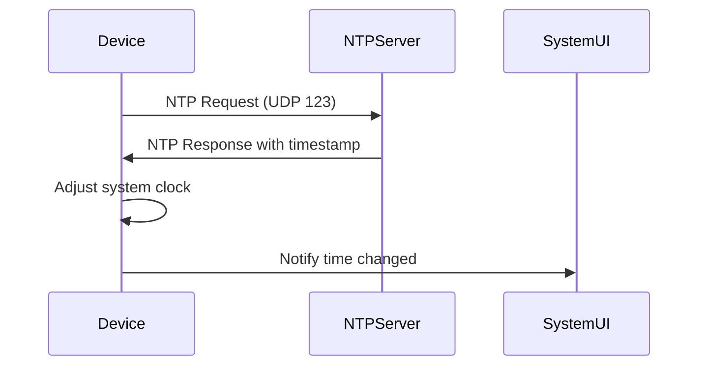

## 问题描述

设备系统时间无法自动更新，通常是由于默认 NTP 服务器连接问题导致

## 修改方案

更换默认 NTP 时间同步服务器

### 修改位置

```diff
# 文件路径
frameworks/base/core/res/res/values/config.xml

# 修改内容
@@ -1842,7 +1842,7 @@
     <bool name="config_actionMenuItemAllCaps">true</bool>
 
     <!-- Remote server that can provide NTP responses. -->
-    <string translatable="false" name="config_ntpServer">time.android.com</string>
+    <string translatable="false" name="config_ntpServer">2.android.pool.ntp.org</string>
     <!-- Normal polling frequency in milliseconds -->
```

## NTP 服务器说明

| 服务器地址                    | 状态  | 区域   | 可靠性   |
| ------------------------ | --- | ---- | ----- |
| `time.android.com`       | 官方  | 全球   | ★★★★☆ |
| `2.android.pool.ntp.org` | 公共池 | 全球轮询 | ★★★★☆ |
| `cn.pool.ntp.org`        | 公共池 | 中国   | ★★★★☆ |
| `ntp.aliyun.com`         | 阿里云 | 中国   | ★★★★★ |

## 完整时间同步配置

```xml
<!-- NTP 服务器 -->
<string name="config_ntpServer">2.android.pool.ntp.org</string>

<!-- 同步间隔 (毫秒) -->
<integer name="config_ntpPollingInterval">86400000</integer>  <!-- 24小时 -->

<!-- 超时时间 (毫秒) -->
<integer name="config_ntpTimeout">30000</integer>  <!-- 30秒 -->
```

## 验证步骤

1. 检查当前 NTP 服务器：

   ```bash
   adb shell settings get global ntp_server
   # 预期输出：2.android.pool.ntp.org
   ```

2. 手动触发时间同步：

   ```bash
   adb shell cmd network time-sync
   ```

3. 查看同步日志：

   ```bash
   adb logcat | grep NetworkTimeUpdateService
   # 预期输出：NetworkTimeUpdateService: NTP time update successful
   ```

## 调试命令

```bash
# 检查网络连接
adb shell ping -c 4 2.android.pool.ntp.org

# 查看当前时间来源
adb shell dumpsys network_time_update_service

# 强制重新同步
adb shell settings put global auto_time 0
adb shell settings put global auto_time 1
```

## 备选 NTP 服务器

```ini
; 中国大陆推荐
cn.ntp.org.cn
ntp.ntsc.ac.cn
time.windows.com
time.apple.com
```

## 注意事项

1. **防火墙限制**：

   - NTP 使用 UDP 123 端口

   - 确保网络允许访问该端口

2. **时区配置**：\
   同时检查时区设置是否正确：

   ```xml
   <string name="config_timeZoneId">Asia/Shanghai</string>
   ```

3. **硬件时钟**：\
   如果设备有 RTC 电池，检查硬件时钟是否正常：

   ```bash
   adb shell cat /proc/driver/rtc
   ```

4. **深度定制**：\
   如需完全禁用自动时间同步：

   ```java
   // 在 NetworkTimeUpdateService.java 中
   if (SystemProperties.getBoolean("persist.sys.disable_ntp", false)) {
       return;
   }
   ```

## 工作原理


