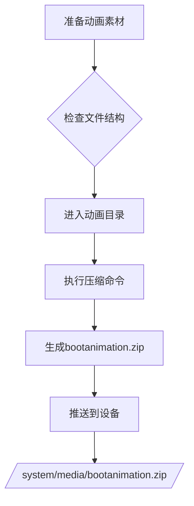

## 🚀 压缩命令

```bash
cd directory/that/contains/desc.txt/and/part0/part1/
zip -r -X -Z store ../bootanimation part*/*.png desc.txt
```

## 🔍 参数解析

| 参数                 | 作用               | 必要性   |
| ------------------ | ---------------- | ----- |
| `-r`               | 递归包含子目录          | ✅ 必需  |
| `-X`               | 不保留额外文件属性        | ⚠️ 推荐 |
| `-Z store`         | 仅存储不压缩           | ✅ 必需  |
| `../bootanimation` | 输出文件名（上级目录）      | ✅ 必需  |
| `part*/*.png`      | 匹配所有part目录的PNG文件 | ✅ 必需  |
| `desc.txt`         | 动画配置文件           | ✅ 必需  |

***

## 📂 目录结构要求

bash

```
bootanimation/
├── desc.txt          # 动画配置文件
├── part0/            # 第一段动画
│   ├── frame_001.png
│   └── frame_002.png
├── part1/            # 第二段动画
│   ├── frame_001.png
│   └── frame_002.png
└── part2/            # 更多分段...
```

## ⚙️ 完整操作流程



### 详细步骤：

1. **准备素材**

   ```bash
   mkdir -p bootanimation/part{0..2}
   cp frames/*.png bootanimation/part0/
   nano bootanimation/desc.txt  # 编辑配置文件
   ```

2. **执行压缩**

   ```bash
   cd bootanimation
   zip -r -X -Z store ../bootanimation.zip part*/*.png desc.txt
   ```

3. **验证压缩包**

   ```bash
   unzip -l ../bootanimation.zip
   # 应显示：
   #   part0/frame_001.png
   #   part0/frame_002.png
   #   desc.txt
   ```

4. **推送至设备**

   ```bash
   adb root
   adb remount
   adb push bootanimation.zip /system/media/
   adb reboot
   ```

***

## ⚠️ 注意事项

1. **压缩模式必须为store**\
   错误方式：

   ```bash
   zip -r ../bootanimation.zip ./*  # 会压缩文件导致无法识别
   ```

2. **文件名必须精确**

   - 输出文件：`bootanimation.zip` (无空格)

   - 配置文件：`desc.txt` (小写)

3. **权限要求**

   ```bash
   adb shell chmod 644 /system/media/bootanimation.zip
   adb shell chown root:root /system/media/bootanimation.zip
   ```

4. **常见错误排查**

   | 现象                    | 解决方案         |
   | --------------------- | ------------ |
   | 黑屏无动画                 | 检查desc.txt格式 |
   | 只显示第一帧                | PNG文件损坏      |
   | 提示"invalid animation" | 压缩时包含多余文件    |

***

## 📝 desc.txt 示例

```plaintext
1080 1920 30   # 宽度 高度 帧率
p 1 0 part0    # 循环次数 间隔 目录
p 0 0 part1    # 0=无限循环
p 0 10 part2   # 10=延迟10帧切换
```

> 💡 **专业提示**：使用`pngcrush`优化PNG文件可减少30%体积
>
> ```bash
> find . -name "*.png" -exec pngcrush -ow {} \;
> ```
