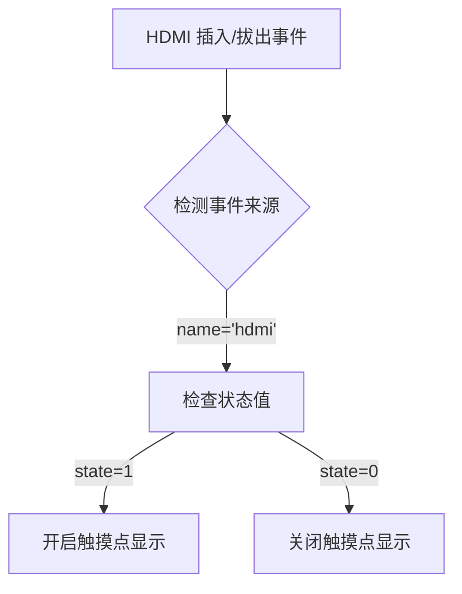

## 功能描述

当 HDMI 线插入设备时，自动开启触摸点显示（白点）功能；当 HDMI 拔出时，自动关闭触摸点显示功能。

## 修改文件

`frameworks/base/services/core/java/com/android/server/WiredAccessoryManager.java`

## 完整代码变更

```diff
diff --git a/services/core/java/com/android/server/WiredAccessoryManager.java b/services/core/java/com/android/server/WiredAccessoryManager.java
index fcda83d..afb438e 100644
--- a/services/core/java/com/android/server/WiredAccessoryManager.java
+++ b/services/core/java/com/android/server/WiredAccessoryManager.java
@@ -44,6 +44,7 @@ import java.io.FileNotFoundException;
 import java.util.ArrayList;
 import java.util.List;
 import java.util.Locale;
+import android.provider.Settings;
 
 /**
  * <p>WiredAccessoryManager monitors for a wired headset on the main board or dock using
@@ -83,10 +84,12 @@ final class WiredAccessoryManager implements WiredAccessoryCallbacks {
 
     private final WiredAccessoryObserver mObserver;
     private final InputManagerService mInputManager;
+	private final Context mContext;
 
     private final boolean mUseDevInputEventForAudioJack;
 
     public WiredAccessoryManager(Context context, InputManagerService inputManager) {
+		mContext = context;
         PowerManager pm = (PowerManager)context.getSystemService(Context.POWER_SERVICE);
         mWakeLock = pm.newWakeLock(PowerManager.PARTIAL_WAKE_LOCK, "WiredAccessoryManager");
         mWakeLock.setReferenceCounted(false);
@@ -406,6 +409,15 @@ final class WiredAccessoryManager implements WiredAccessoryCallbacks {
                 String devPath = event.get("DEVPATH");
                 String name = event.get("SWITCH_NAME");
                 int state = Integer.parseInt(event.get("SWITCH_STATE"));
+
+				if(name.equals("hdmi")){
+					if(state == 1){
+						Settings.System.putInt(mContext.getContentResolver(), Settings.System.SHOW_TOUCHES, 1);
+					}else if(state == 0){
+						Settings.System.putInt(mContext.getContentResolver(), Settings.System.SHOW_TOUCHES, 0);
+					}
+				}
+
                 synchronized (mLock) {
                     updateStateLocked(devPath, name, state);
                 }
```

## 实现原理

### 1. HDMI 状态检测



### 2. 关键代码逻辑

1. **添加 Context 引用**：

   ```java
   private final Context mContext;  // 保存上下文引用
   ```

2. **构造函数初始化**：

   ```java
   public WiredAccessoryManager(Context context, InputManagerService inputManager) {
       mContext = context;  // 保存上下文对象
       // ...其他初始化代码...
   }
   ```

3. **HDMI 事件处理**：

   ```java
   if(name.equals("hdmi")) {
       if(state == 1) {
           // 插入HDMI时开启触摸点显示
           Settings.System.putInt(mContext.getContentResolver(), 
                                 Settings.System.SHOW_TOUCHES, 1);
       } else if(state == 0) {
           // 拔出HDMI时关闭触摸点显示
           Settings.System.putInt(mContext.getContentResolver(), 
                                 Settings.System.SHOW_TOUCHES, 0);
       }
   }
   ```

### 3. 系统设置说明

- **SHOW\_TOUCHES** 系统属性：

  - `0`：关闭触摸点显示

  - `1`：开启触摸点显示
- 对应开发者选项中的"显示点按操作反馈"功能

## 注意事项

1. **权限要求**：

   - 需要 `WRITE_SECURE_SETTINGS` 权限才能修改 `SHOW_TOUCHES` 系统设置

   - 在 AndroidManifest.xml 中添加：

     ```xml
     <uses-permission android:name="android.permission.WRITE_SECURE_SETTINGS"/>
     ```
2. **HDMI 事件标识**：

   - 依赖 UEvent 事件中 `SWITCH_NAME="hdmi"` 的标识

   - 状态值 `1` 表示插入，`0` 表示拔出
3. **系统服务位置**：

   - 修改位于 `com.android.server` 包中的系统服务

   - 需要系统签名权限
4. **兼容性**：

   - 此修改针对 Android 8.1 (API 27) 系统

   - 不同 Android 版本中 UEvent 事件结构可能不同

## 测试建议

1. 插入 HDMI 线缆后检查：

   - 设置 → 系统 → 开发者选项 → 显示点按操作反馈 应自动开启

   - 屏幕触摸时应显示白色圆点
2. 拔出 HDMI 线缆后检查：

   - 显示点按操作反馈 应自动关闭

   - 屏幕触摸时不应显示白色圆点
