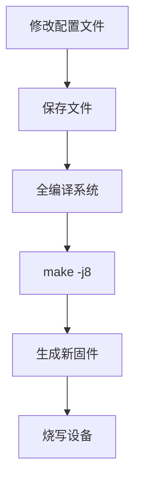

## 修改目标

将设备的默认蓝牙名称从 `"TL-3494"` 更改为自定义名称

## 关键配置文件

```path
device/rockchip/rk312x/bluetooth/bdroid_buildcfg.h
```

## 修改步骤

### 1. 定位配置文件

在源码目录中找到：

```bash
cd <android-source>/device/rockchip/rk312x/bluetooth/
vim bdroid_buildcfg.h  # 使用任意编辑器打开
```

### 2. 修改蓝牙名称定义

找到以下宏定义：

```c
#define BTM_DEF_LOCAL_NAME "TL-3494"
```

修改引号内的名称为自定义名称（例如）：

```c
#define BTM_DEF_LOCAL_NAME "My_RK3126_Device"
```

### 3. 保存并重新编译



## 名称规则建议

1. 长度限制：≤ 30个字符（Android蓝牙协议限制）

2. 有效字符：字母、数字、空格、连字符(-)

3. 避免特殊字符：`! @ # $ % ^ & * ( ) + = { } [ ] | \ : ; " ' < > ? , . /`

4. 示例：

   ```c
   #define BTM_DEF_LOCAL_NAME "RK3126-SmartDevice"  // 有效
   #define BTM_DEF_LOCAL_NAME "Home_Bluetooth_Box"  // 有效
   #define BTM_DEF_LOCAL_NAME "Device#2024"         // 避免使用#号
   ```

## 验证方法

1. 烧写新固件后启动设备

2. 开启蓝牙功能

3. 从其他设备扫描蓝牙：

   ```bash
   # Android手机查看
   设置 > 蓝牙 > 可用设备
    
   # Linux电脑查看
   bluetoothctl
   scan on
   ```

4. 确认显示的名称与修改一致

## 注意事项

1. **必须重新编译系统**才能生效

2. 修改后需清除旧蓝牙缓存：

   - 其他设备需忘记旧设备记录

   - 或重启蓝牙扫描

3. 同时修改设备型号（可选）：

   ```c
   // 同文件中的设备型号定义
   #define BTA_DM_COD {0x1A, 0x01, 0x0C}  // 设备类代码
   ```

4. 名称修改仅影响新连接，已配对设备可能显示旧名称直到重新配对

## 高级配置

### 实现动态名称（需代码修改）

在 `frameworks/base/core/java/android/bluetooth/BluetoothAdapter.java` 中添加：

```java
public boolean setLocalName(String name) {
    if (name == null || name.length() > 30) return false;
    return mService.setName(name);
}
```

### 通过系统属性设置

在 `system.prop` 中添加：

```properties
# 蓝牙名称系统属性
ro.product.bluetooth.name=Custom_RK3126
```

然后在代码中读取该属性值（需代码支持）

> **提示**：静态名称修改适用于固定设备，动态名称方案适用于需要用户自定义的场景
