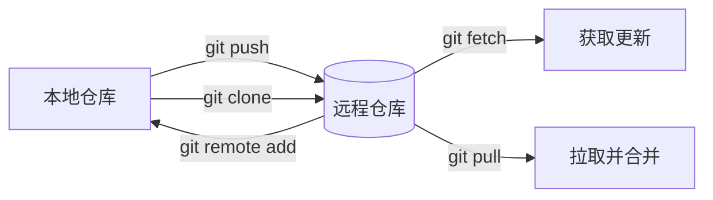

## 📍 添加远程仓库

```bash
# 基本命令
git remote add <远程名称> <仓库URL>

# 示例 (通常命名为 origin)
git remote add origin https://github.com/用户名/项目名.git
```

## 🔍 查看远程仓库

```bash
# 查看已配置的远程仓库
git remote -v

# 输出示例
origin  https://github.com/user/repo.git (fetch)
origin  https://github.com/user/repo.git (push)
```

## 🛠️ 常用远程操作

| 操作        | 命令                                 | 说明        |
| --------- | ---------------------------------- | --------- |
| **重命名**   | `git remote rename <旧名称> <新名称>`    | 修改远程仓库别名  |
| **修改URL** | `git remote set-url <远程名称> <新URL>` | 更新仓库地址    |
| **删除**    | `git remote remove <远程名称>`         | 移除远程关联    |
| **推送**    | `git push -u <远程名称> <分支名>`         | 首次推送并建立跟踪 |
| **克隆**    | `git clone <仓库URL>`                | 下载远程仓库    |

## 🌐 协议对比表

| 协议类型  | 示例URL                              | 适用场景        |
| ----- | ---------------------------------- | ----------- |
| HTTPS | `https://github.com/user/repo.git` | 通用场景，需输密码   |
| SSH   | `git@github.com:user/repo.git`     | 免密登录（需配置密钥） |
| Git   | `git://github.com/user/repo.git`   | 只读访问（已较少使用） |

## 🔄 工作流程图



## ⚠️ 常见问题解决

1. **权限拒绝错误**

   ```bash
   # 错误提示：Permission denied (publickey)
   # 解决方案：生成并添加SSH密钥
   ssh-keygen -t ed25519 -C "your_email@example.com"
   cat ~/.ssh/id_ed25519.pub  # 复制到Git服务商设置
   ```

2. **修改远程URL协议**

   ```bash
   # 从HTTPS切换为SSH
   git remote set-url origin git@github.com:user/repo.git
   ```

3. **首次推送提示**

   ```bash
   # 出现：fatal: 当前分支 master 没有对应的上游分支
   # 解决方案：建立上游跟踪
   git push --set-upstream origin master
   ```

## 💡 最佳实践

1. 使用 `SSH协议` 避免重复输入密码

2. 主仓库建议命名为 `origin`

3. 使用 `-u` 参数首次推送：`git push -u origin main`

4. 定期执行 `git remote -v` 验证配置
