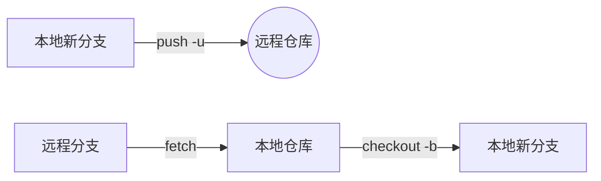

## 1. 推送新分支到远程仓库

```git
git push --set-upstream origin 分支名
```

- **作用**：创建并推送本地新分支到远程仓库

- **关键参数**：

  - `--set-upstream` (或 `-u`)：建立本地分支与远程分支的追踪关系

  - `origin`：默认远程仓库名称（可替换为其他远程名称）

- **后续推送简化**：建立关联后只需执行 `git push`

## 2. 拉取远程仓库分支

### 方法一：两步操作（推荐）

```git
git fetch origin 分支名       # 获取远程分支数据
git checkout -b 分支名 origin/分支名  # 创建并切换到本地分支
```

- **优势**：更可控，可先检查远程分支内容

### 方法二：单步操作

```git
git checkout --track origin/分支名  # 自动创建同名本地分支
```

## 流程图解



## 注意事项

1. 首次推送前确保已提交本地更改 (`git commit`)

2. 分支名建议：

   - 使用小写字母和连字符（如 `feat/user-auth`）

   - 避免空格和特殊字符

3. 查看远程分支信息：

   ```git
   git branch -r          # 查看远程分支
   git remote show origin # 显示远程仓库详情
   ```

4. 更新已关联分支：

   ```git
   git pull # 在已关联分支上直接更新
   ```

**最佳实践**：保持本地分支名与远程分支名一致可减少混淆
