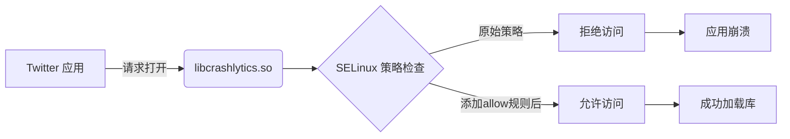

## 问题现象

从 logcat 可见关键错误信息：

```log
07-13 20:12:106.063 W twitter.android: 
avc: denied { open } for 
path="/data/app-lib/com.twitter.android/arm/libcrashlytics.so" 
secontext=u:r:untrusted_app_25:s0:c512,c676 
tcontext=u:object_r:system_data_file:s0 
tclass=file permissions=0

07-13 20:12:106.111 E AndroidRuntime: 
java.lang.UnsatisfiedLinkError: 
couldn't find "libcrashlytics.so"
```

## 错误分析

1. **核心问题**：SELinux 策略禁止应用访问共享库

2. **访问主体**：`untrusted_app_25` (Twitter 应用)

3. **目标资源**：`system_data_file` 类型的文件

4. **所需权限**：`open` 操作权限

5. **影响结果**：导致 native 库加载失败，应用崩溃

## 解决方案

在 SELinux 策略文件中添加允许规则：

### 修改文件

`device/rockchip/common/sepolicy/untrusted_app_25.te`

### 添加内容

```sepolicy
# 允许 untrusted_app_25 域打开 system_data_file 类型的文件
allow untrusted_app_25 system_data_file:file { open };
```

## 验证步骤

1. 修改 SELinux 策略文件

2. 重新编译系统镜像

3. 刷机后运行 Twitter 应用

4. 检查 logcat 确认无权限拒绝日志：

```bash
adb logcat | grep 'avc: .* denied'
```

## 技术原理



## 关联知识

1. **SELinux 上下文**：

   - `u:r:untrusted_app_25:s0`：第三方应用进程上下文

   - `u:object_r:system_data_file:s0`：系统数据文件标签

2. **策略语法**：

   ```bnf
   allow <domain> <type>:<class> { <permissions> };
   ```

3. **常见文件操作权限**：

   - `open`：打开文件

   - `read`：读取文件

   - `write`：写入文件

   - `execute`：执行文件

## 扩展建议

若仍遇权限问题，可临时审查模式调试：

```bash
# 进入审查模式
adb shell su 0 setenforce 0

# 收集拒绝日志
adb shell su 0 cat /proc/kmsg | grep 'avc:' 

# 生成自动修复规则（需audit2allow工具）
adb logcat -d | audit2allow -p policy.29.0
```

> **注意**：生产环境需保持 `setenforce 1` 确保系统安全
