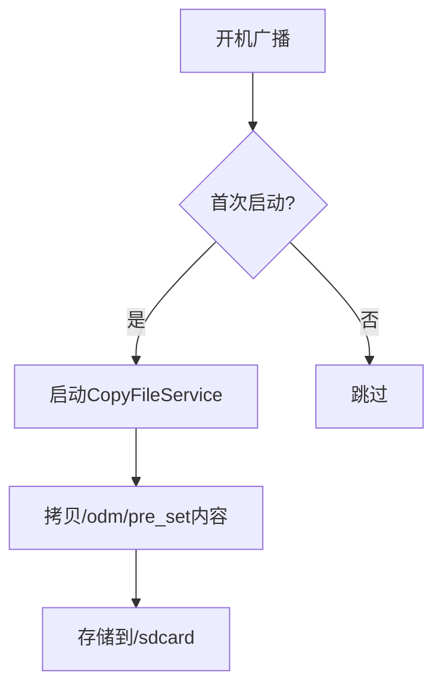

## 📂 文件预置流程

### 1. 资源文件放置位置

```bash
device/rockchip/rk3588/rk3588s_s/tools/test.mp4
```

### 2. 编译时拷贝到系统分区

修改设备Makefile文件：

```diff
diff --git a/device/rockchip/rk3588/rk3588s_s/rk3588s_s.mk b/device/rockchip/rk3588/rk3588s_s/rk3588s_s.mk
+PRODUCT_COPY_FILES += \
+    $(LOCAL_PATH)/tools/test.mp4:$(TARGET_COPY_OUT_ODM)/pre_set/Movies/test.mp4
```

### 3. 首次开机拷贝到SD卡

实现逻辑：



## ⚙️ 核心代码实现

### 1. AndroidManifest.xml 注册服务

```diff
--- a/AndroidManifest.xml
+++ b/AndroidManifest.xml
@@ -98,6 +98,11 @@
         	</intent-filter>
         </receiver>
         
+        <service
+            android:name="com.android.providers.media.CopyFileService"
+            android:enabled="true"
+            android:exported="true" />
+
         <service
             android:name="com.android.providers.media.IdleService"
             android:exported="true"
```

### 2. 新增 CopyFileService.java

```java
public class CopyFileService extends Service {
    private static final String TAG = "CopyFileService";
    private static String PRELOAD_SRC = Environment.getOdmDirectory() + "/pre_set";
    private static String PRELOAD_DEST = Environment.getExternalStorageDirectory().getAbsolutePath();

    @Override
    public int onStartCommand(Intent intent, int flags, int startId) {
        new CopyThread().start(); // 启动拷贝线程
        return Service.START_REDELIVER_INTENT;
    }

    class CopyThread extends Thread {
        public void run() {
            copyFolder(new File(PRELOAD_SRC), new File(PRELOAD_DEST));
            stopSelf();
        }
    }
    
    // 文件夹拷贝逻辑
    private boolean copyFolder(File src, File dest) {
        if (!src.isDirectory()) return false;
        if (!dest.exists()) dest.mkdirs();
        
        for (File f : src.listFiles()) {
            if (f.isDirectory()) {
                copyFolder(f, new File(dest, f.getName()));
            } else {
                copyFile(f, new File(dest, f.getName()));
            }
        }
        return true;
    }
    
    // 文件拷贝逻辑（带4KB缓冲区）
    private boolean copyFile(File src, File dest) {
        try (InputStream in = new FileInputStream(src);
             FileOutputStream out = new FileOutputStream(dest)) {
            
            byte[] buffer = new byte[4096];
            int bytesRead;
            while ((bytesRead = in.read(buffer)) >= 0) {
                out.write(buffer, 0, bytesRead);
            }
            out.getFD().sync(); // 确保写入磁盘
            return true;
        } catch (IOException e) {
            Log.e(TAG, "Copy failed: " + e.getMessage());
            return false;
        }
    }
}
```

### 3. MediaReceiver 首次启动判断

```diff
--- a/src/com/android/providers/media/MediaReceiver.java
+++ b/src/com/android/providers/media/MediaReceiver.java
@@ -30,6 +34,17 @@ public class MediaReceiver extends BroadcastReceiver {
                          // Register our idle maintenance service
             IdleService.scheduleIdlePass(context);
 
+            SharedPreferences sp = context.getSharedPreferences("first_boot", Context.MODE_PRIVATE);
+            boolean firstBoot = sp.getBoolean("first_boot", true);
+            
+            if (firstBoot) {
+                Intent serviceIntent = new Intent(context, CopyFileService.class);
+                context.startService(serviceIntent);
+            }
+
+            sp.edit()
+                .putBoolean("first_boot", false)
+                .apply();
         } else {
             // All other operations are heavier-weight
```

## 🔍 关键技术点

1. **文件路径定义**：

   ```java
   // 源路径：ODM分区预置文件
   Environment.getOdmDirectory() + "/pre_set" 

   // 目标路径：内部存储根目录
   Environment.getExternalStorageDirectory()
   ```

2. **首次启动判断**：

   - 使用 `SharedPreferences` 存储 `first_boot` 标志

   - 只在第一次开机时执行拷贝操作

3. **高效文件拷贝**：

   - 4KB缓冲区减少IO操作次数

   - `FileDescriptor.sync()` 确保数据落盘

   - 递归处理子目录

4. **服务管理**：

   ```java
   // 启动服务
   context.startService(new Intent(context, CopyFileService.class));

   // 服务完成任务后自动停止
   stopSelf();
   ```

## ⚠️ 注意事项

1. **存储权限**：

   ```xml
   <!-- 在AndroidManifest.xml中添加权限 -->
   <uses-permission android:name="android.permission.READ_EXTERNAL_STORAGE"/>
   <uses-permission android:name="android.permission.WRITE_EXTERNAL_STORAGE"/>
   ```

2. **大文件处理**：

   - 建议文件不超过100MB

   - 大文件拷贝需添加进度通知

   - 考虑使用`AsyncTask`或`JobService`

3. **路径兼容性**：

   ```java
   // 推荐使用Android API获取路径
   Environment.getExternalStoragePublicDirectory(Environment.DIRECTORY_MOVIES)
   ```

4. **错误处理增强建议**：

   ```java
   // 添加存储空间检查
   if (dest.getFreeSpace() < src.length() * 1.2) {
       Log.w(TAG, "Insufficient storage space");
       return false;
   }
   ```

## 🌟 扩展应用

1. **多文件类型支持**：

   ```bash
   /odm/pre_set
   ├── Movies/       # 视频文件
   ├── Music/        # 音频文件
   ├── Pictures/     # 图片文件
   └── Documents/    # 文档文件
   ```

2. **动态配置**：

   ```java
   // 通过属性控制预置文件
   if (SystemProperties.getBoolean("persist.sys.copy_preload", true)) {
       // 执行拷贝
   }
   ```

> 💡 **性能提示**：对于超过50MB的文件，建议使用`FileChannel.transferTo()`方法提高拷贝效率。
