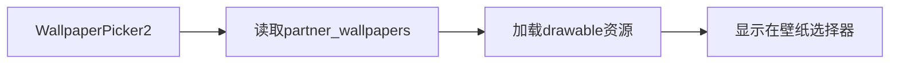

#### 📁 文件结构

bash

```
vendor/partner_gms/
└── apps/
    └── GmsSampleIntegration/
        └── res/
            ├── drawable/
            │   ├── wp1.jpg        # 全尺寸壁纸
            │   └── wp1_small.jpg  # 缩略图（建议比例1:10）
            └── values/
                └── partner_wallpapers.xml  # 壁纸声明文件
```

#### 📝 partner\_wallpapers.xml 内容

```xml
<?xml version="1.0" encoding="utf-8"?>
<resources>
    <string-array name="partner_wallpapers" translatable="false">
        <item>wp1</item>  <!-- 对应drawable/wp1.jpg -->
        <!-- 添加更多壁纸: <item>wp2</item> -->
    </string-array>
</resources>
```

#### ⚙️ 实现原理



1. **资源匹配机制**：

   - 系统自动扫描所有`partner_wallpapers.xml`

   - 按`<item>`顺序加载对应名称的drawable资源

   - 自动匹配`_small`后缀的缩略图
2. **双图要求**：

   | 文件类型  | 命名规范            | 推荐分辨率     | 用途    |
   | ----- | --------------- | --------- | ----- |
   | 全尺寸壁纸 | `wpX.jpg`       | 设备分辨率2倍   | 实际应用  |
   | 缩略图   | `wpX_small.jpg` | 100-200KB | 选择器预览 |

#### ⚠️ 注意事项

1. **版权合规**：

   - 必须使用有合法版权的壁纸

   - 避免使用GMS默认壁纸（可能导致认证失败）
2. **文件规范**：

   - 仅支持.jpg/.png格式

   - 文件名必须全小写+下划线命名法

   - XML中`<item>`值必须与文件名前缀一致
3. **多壁纸配置**：

   ```xml
   <!-- 示例：三张壁纸配置 -->
   <string-array name="partner_wallpapers">
       <item>sunset</item>
       <item>mountain</item>
       <item>ocean</item>
   </string-array>
   ```

   需配套文件：

   ```text
   drawable/sunset.jpg
   drawable/sunset_small.jpg
   drawable/mountain.jpg
   ...
   ```

#### ✅ 验证方法

1. 刷机后进入：

   ```bash
   adb shell am start -n com.android.wallpaper/.picker.WallpaperOnlyActivity
   ```

2. 检查日志：

   ```bash
   adb logcat | grep -i wallpaper
   # 查找成功加载记录: Loaded partner wallpapers: [wp1]
   ```

3. 文件存在性检查：

   ```bash
   adb shell ls /product/overlay/GmsSampleIntegration/res/drawable/wp*
   ```

> **GMS认证提示**：根据CDD 3.8.1要求，设备必须提供至少1张静态壁纸。此实现方式符合Google对AOSP设备的壁纸预置规范。
